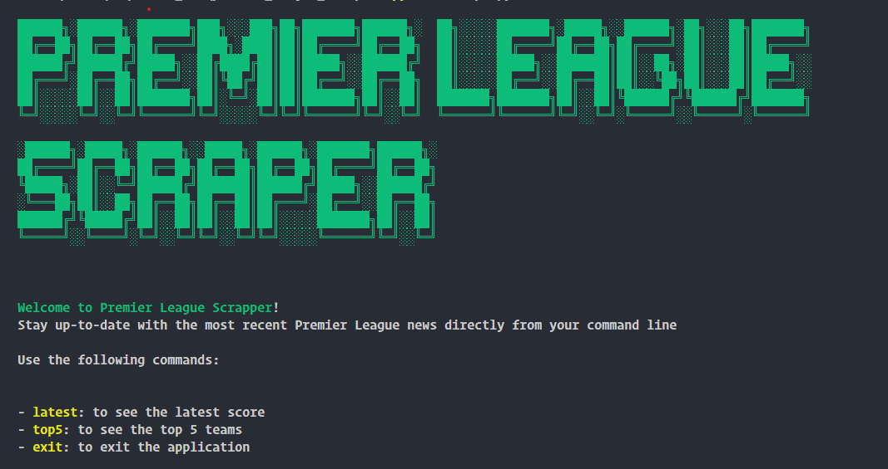

# Premier League Scraper

Premier League Scraper provides a simple and open-source solution for accessing up-to-date soccer news directly from your terminal.

## Getting Started

Install all the modules and run `python3 script.py` or `python script.py`

## Tech Stack & Modules

- Python3
- requests
- bs4
- pandas
- io

> If you’d like to see my other works and/or connect with me, here's my [Personal website](https://godswillumukoro.com/).